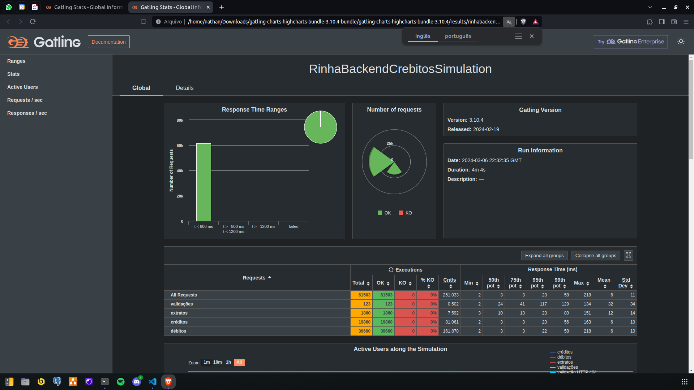

# Rinha Backend 2024-Q1: Crebito

## Nathan Bahia

### Disclaimer: O código apresentado aqui não deve nunca ser usado em produção!

[Link do repositório](https://github.com/nathanbahiadev/RinhaBackend2024Q1__Python)

API desenvolvida utlizando:
- Python - https://python.org/
- Sanic - https://sanic.dev/en/
- Postgres - https://www.postgresql.org/docs/
- Nginx - https://nginx.org/en/docs/

Minhas redes sociais:
- Github - https://github.com/nathanbahiadev
- LinkedIn - https://linkedin.com/in/nathanbahia

 